## Cartpole

### Small Batch

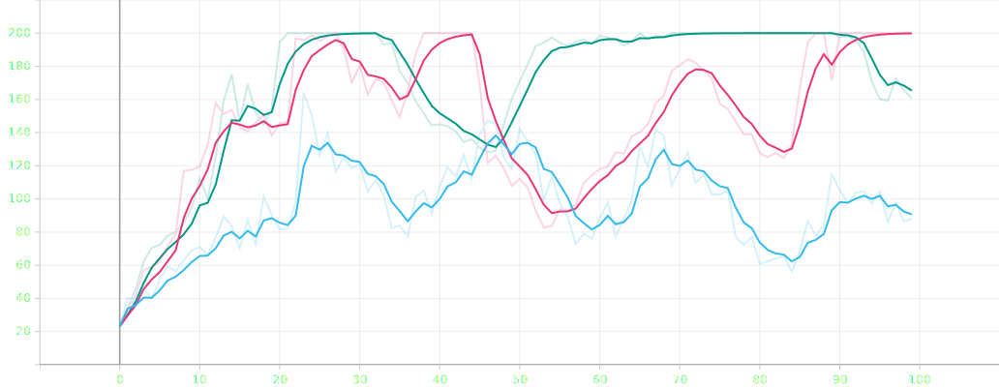*Cartpole Small Batch Training Average Return*

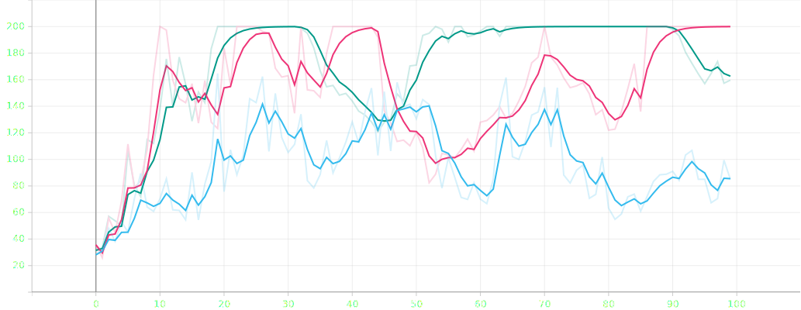*Cartpole Small Batch Eval Return*

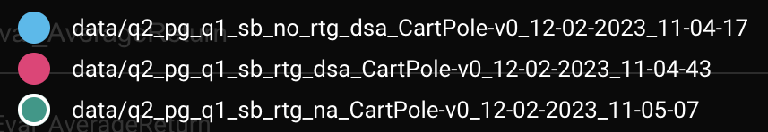*Cartpole Small Batch Legend*

### Large Batch

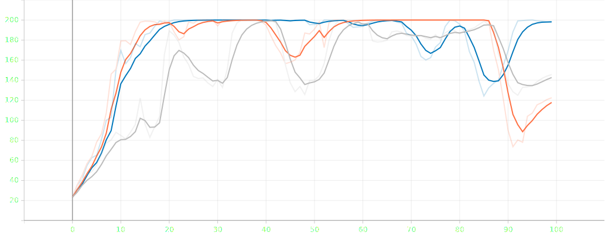*Cartpole Large Batch Training Average Return*

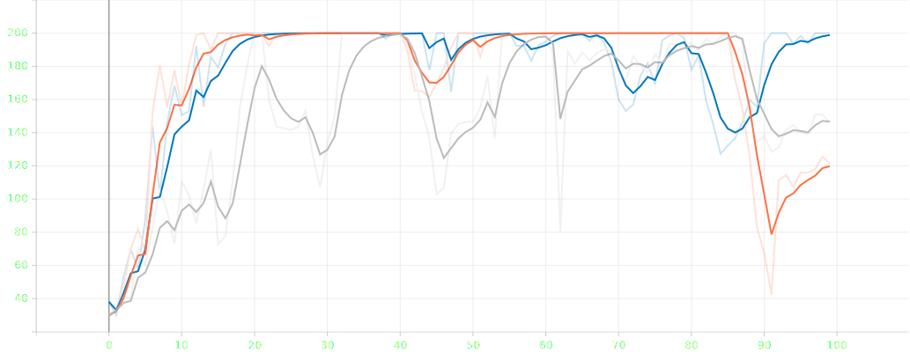*Cartpole Large Batch Eval Return*

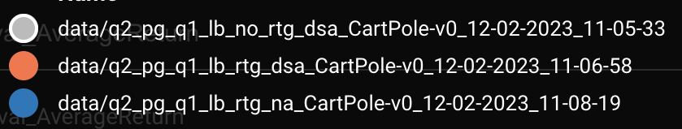*Cartpole Large Batch Legend*

## Inverted Pendulum

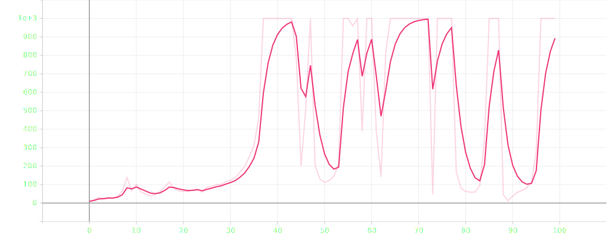*Inverted Pendulum Training Average Return*

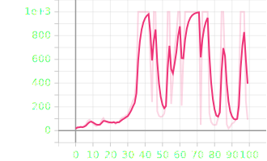*Inverted Pendulum Eval Return*

*Inverted Pendulum Legend*

## Lunar Lander

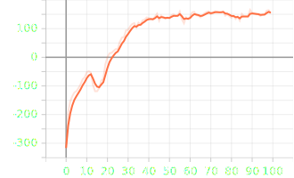*Lunar Lander Training Average Return*

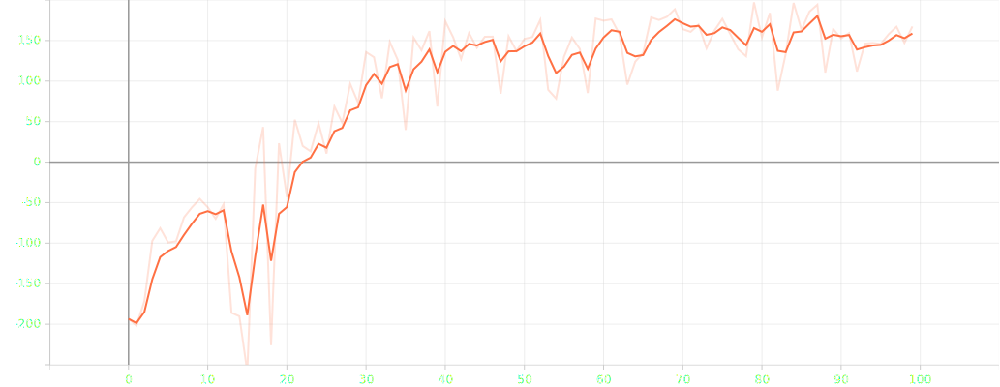*Lunar Lander Eval Return*

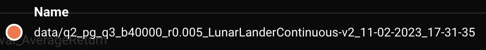*Lunar Lander Legend*

## Half Cheetah

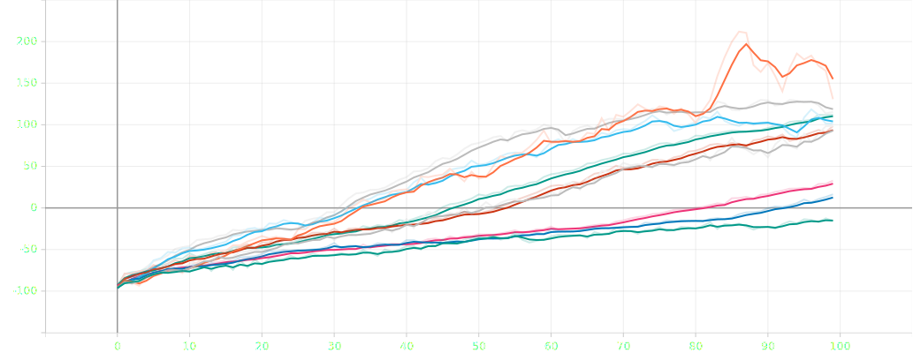*Half Cheetah Training Average Return*

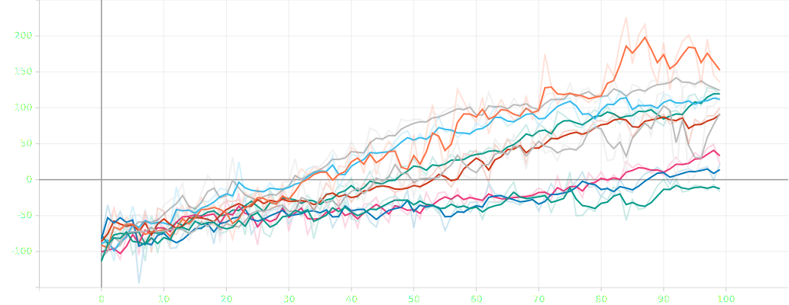*Half Cheetah Eval Return*

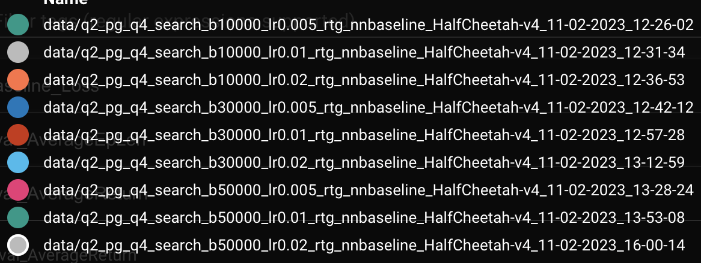*Half Cheetah Legend*

## Hopper

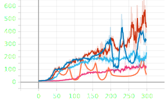*Hopper Training Average Return*

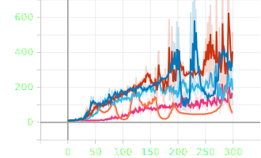*Hopper Eval Return*

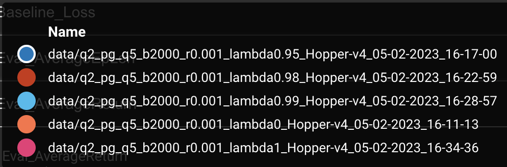*Hopper Legend*